# App Flows - Parapluie

## 1. Seniors Onboarding Flow

```mermaid
flowchart LR
A[User Launches App] --> B[Welcome Screen]
B -- { Continuer ? } --> C[Permission Screen]
B -- { Sauter ? } --> C[Permision Screen]
C -- { Accepter ? } --> D[Invitation Screen]
C -- { Sauter ? } --> D[Invitation Screen]
D -- { Ajouter contact ? } --> E[Contact Info]
E -- { Creer Invitation ? } --> F[Code Share Screen]
D -- { Sauter ? } --> G[Home Screen]
F -- { Envoyer code par SMS ?} --> F[Confirmation Confirmation Screen]
F -- { Envoyer code par Email ?} --> I[Confirmation Screen]
F -- { En personne ? } --> I[Confirmation Screen]
I -- { Terminer ? } --> G[Home Screen] 

%% Styling
classDef start fill:#ffffff,stroke:#E8E47F,stroke-width:2px
classDef screens fill:#ffffff,stroke:#6FDAC8,stroke-width:2px

class A start
class B,C,D,E,F,I,G screens
```



## 2. Trusted Contact Flow

## 3. Authentication Flow

## 4. Main navigation Flow

### Three main routes:

1. /home (Accueil) - Home screen with dashboard
2. /walter (Walter) - AI chat modal/screen
3. /security (Sécurité) - Safety settings and controls


## 5. Security Events Flow

```mermaid
graph TD
    Start[Safety Events Card on Home] --> Decision1{User Action?}
    
    Decision1 -->|Tap on Card| SafetyEvents[Safety Events Screen]
    Decision1 -->|Tap 'See All Calls'| CallHistory[Call History Screen]
    Decision1 -->|Tap 'See All SMS'| SMSHistory[SMS History Screen]
    Decision1 -->|Tap 'See Threats'| ThreatHistory[Threat History Screen]
    
    SafetyEvents --> EventDecision{User Selection?}
    EventDecision -->|View Call History| CallHistory
    EventDecision -->|View SMS History| SMSHistory
    EventDecision -->|View Threat History| ThreatHistory
    EventDecision -->|Back| Start
    
    CallHistory --> CallAction{User Action?}
    CallAction -->|Select Call| CallDetails[Call Event Details]
    CallAction -->|Back| SafetyEvents
    
    SMSHistory --> SMSAction{User Action?}
    SMSAction -->|Select SMS| SMSDetails[SMS Event Details]
    SMSAction -->|Back| SafetyEvents
    
    ThreatHistory --> ThreatAction{User Action?}
    ThreatAction -->|Select Threat| ThreatDetails[Threat Event Details]
    ThreatAction -->|Back| SafetyEvents
    
    CallDetails --> AskWalterCall{Ask Walter about Call?}
    AskWalterCall -->|Yes| WalterCallAnalysis[Walter AI Analysis:<br/>Explains threat level,<br/>provides context,<br/>shows similar patterns]
    AskWalterCall -->|No| CallReportDecision
    
    WalterCallAnalysis --> WalterRecommendation{Walter's Assessment}
    WalterRecommendation -->|Low Risk| WalterSaysNoAction[Walter: 'This looks like<br/>a regular telemarketer.<br/>I blocked it for you.<br/>No action needed.']
    WalterRecommendation -->|Medium Risk| WalterSaysCaution[Walter: 'This looks suspicious.<br/>Here's why...<br/>Want to report it?']
    WalterRecommendation -->|High Risk| WalterSaysReport[Walter: 'This is serious.<br/>I recommend reporting<br/>to authorities.<br/>I can help you.']
    WalterRecommendation -->|Critical + User Confused| WalterNotifyFamily[Walter Auto-Notifies<br/>Family Contact:<br/>'Mary received serious<br/>scam - please check in']
    
    WalterSaysNoAction --> CallReportDecision
    WalterSaysCaution --> CallReportDecision
    WalterSaysReport --> SuggestReport[Suggest Reporting<br/>with Context]
    WalterNotifyFamily --> SuggestReport
    
    SuggestReport --> CallReportDecision{User Wants to Report?}
    
    CallReportDecision -->|Report as Safe| MarkCallSafe[Mark Call as Safe]
    CallReportDecision -->|Report as Unsafe| MarkCallUnsafe[Mark Call as Unsafe]
    CallReportDecision -->|No Action| CallBackOption
    
    MarkCallSafe --> AILearnSafe[AI Learns:<br/>Updates pattern recognition,<br/>Reduces false positives,<br/>May whitelist similar calls]
    MarkCallUnsafe --> UnsafeOptions[Report Options:<br/>Call Fraud Center,<br/>Copy Details,<br/>Share with Family]
    
    AILearnSafe --> CallBackOption{Back?}
    
    UnsafeOptions --> FraudCenterDecision{Contact Authorities?}
    FraudCenterDecision -->|Yes| AuthorityChoice[Walter Suggests Best Contact:<br/>Anti-Fraud Centre,<br/>Local Police Non-Emergency,<br/>Consumer Protection]
    FraudCenterDecision -->|Copy Details| CopyDetails[Copy Event Details<br/>to Clipboard]
    FraudCenterDecision -->|Share with Family| NotifyFamily[Send Alert to<br/>Trusted Contact]
    FraudCenterDecision -->|Cancel| CallBackOption
    
    AuthorityChoice --> SelectAuthority{Which Authority?}
    SelectAuthority -->|Anti-Fraud Centre| CallAntifraud[Launch Call:<br/>1-888-495-8501<br/>Pre-filled]
    SelectAuthority -->|Local Police| CallPolice[Launch Call:<br/>Local Non-Emergency<br/>Based on Location]
    SelectAuthority -->|Consumer Protection| CallConsumer[Launch Call:<br/>Provincial Agency<br/>Based on Location]
    SelectAuthority -->|Back| UnsafeOptions
    
    CallAntifraud --> CallComplete[Call Completed]
    CallPolice --> CallComplete
    CallConsumer --> CallComplete
    
    CallComplete --> LogReport[Log Report in History<br/>Notify Family Dashboard]
    CopyDetails --> CallBackOption
    NotifyFamily --> CallBackOption
    LogReport --> AILearnThreat[AI Learns from Report:<br/>Updates threat detection,<br/>Shares pattern anonymously,<br/>Protects other users]
    
    AILearnThreat --> CallBackOption
    CallBackOption -->|Back| CallHistory
    CallBackOption -->|Home| Start
    
    SMSDetails --> AskWalterSMS{Ask Walter about SMS?}
    AskWalterSMS -->|Yes| WalterSMSAnalysis[Walter AI Analysis:<br/>Checks links,<br/>Identifies phishing,<br/>Explains risks]
    AskWalterSMS -->|No| SMSReportDecision
    
    WalterSMSAnalysis --> WalterSMSAssessment{Walter's Assessment}
    WalterSMSAssessment -->|Safe| WalterSMSSafe[Walter: 'This is from<br/>your pharmacy.<br/>The link is legitimate.']
    WalterSMSAssessment -->|Suspicious| WalterSMSSuspicious[Walter: 'This looks like<br/>a phishing attempt.<br/>Never click these links.']
    WalterSMSAssessment -->|Dangerous| WalterSMSDangerous[Walter: 'This is a scam.<br/>Delete immediately.<br/>Report to authorities?']
    
    WalterSMSSafe --> SMSReportDecision
    WalterSMSSuspicious --> SMSReportDecision
    WalterSMSDangerous --> SMSReportDecision
    
    SMSReportDecision -->|Report as Safe| MarkSMSSafe[Mark SMS as Safe<br/>AI Learns Pattern]
    SMSReportDecision -->|Report as Unsafe| MarkSMSUnsafe[Mark SMS as Unsafe<br/>Report Options]
    SMSReportDecision -->|Back| SMSHistory
    
    MarkSMSSafe --> SMSBackOption{Back?}
    MarkSMSUnsafe --> SMSReportOptions[Same reporting flow<br/>as calls]
    SMSReportOptions --> SMSBackOption
    SMSBackOption -->|Back| SMSHistory
    SMSBackOption -->|Home| Start
    
    ThreatDetails --> AskWalterThreat{Ask Walter?}
    AskWalterThreat -->|Yes| WalterThreatAnalysis[Walter Threat Analysis:<br/>Full context,<br/>Similar incidents,<br/>Action guidance]
    AskWalterThreat -->|No| ThreatReportDecision
    
    WalterThreatAnalysis --> ThreatReportDecision{Take Action?}
    ThreatReportDecision -->|Report| ThreatReportFlow[Same reporting flow<br/>with authority contact]
    ThreatReportDecision -->|Dismiss| AILearnDismiss[AI Learns:<br/>Was this a false alarm?<br/>Adjust sensitivity]
    ThreatReportDecision -->|Back| ThreatHistory
    
    ThreatReportFlow --> ThreatBackOption{Back?}
    AILearnDismiss --> ThreatBackOption
    ThreatBackOption -->|Back| ThreatHistory
    ThreatBackOption -->|Home| Start
    
    style Start fill:#667eea
    style WalterCallAnalysis fill:#48bb78
    style WalterSMSAnalysis fill:#48bb78
    style WalterThreatAnalysis fill:#48bb78
    style WalterSaysReport fill:#f56565
    style WalterNotifyFamily fill:#f56565
    style AILearnSafe fill:#4299e1
    style AILearnThreat fill:#4299e1
    style AILearnDismiss fill:#4299e1
    style CallAntifraud fill:#ed8936
    style CallPolice fill:#ed8936
    style CallConsumer fill:#ed8936
    ```
