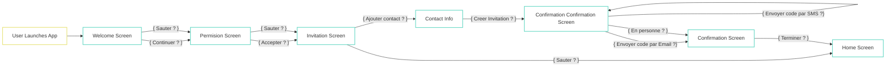

# App Flows - Parapluie

## 1. Seniors Onboarding Flow

```mermaid
flowchart LR
A[User Launches App] --> B[Welcome Screen]
B -- { Continuer ? } --> C[Permission Screen]
B -- { Sauter ? } --> C[Permision Screen]
C -- { Accepter ? } --> D[Invitation Screen]
C -- { Sauter ? } --> D[Invitation Screen]
D -- { Ajouter contact ? } --> E[Contact Info]
E -- { Creer Invitation ? } --> F[Code Share Screen]
D -- { Sauter ? } --> G[Home Screen]
F -- { Envoyer code par SMS ?} --> F[Confirmation Confirmation Screen]
F -- { Envoyer code par Email ?} --> I[Confirmation Screen]
F -- { En personne ? } --> I[Confirmation Screen]
I -- { Terminer ? } --> G[Home Screen] 

%% Styling
classDef start fill:#ffffff,stroke:#E8E47F,stroke-width:2px
classDef screens fill:#ffffff,stroke:#6FDAC8,stroke-width:2px

class A start
class B,C,D,E,F,I,G screens
```
