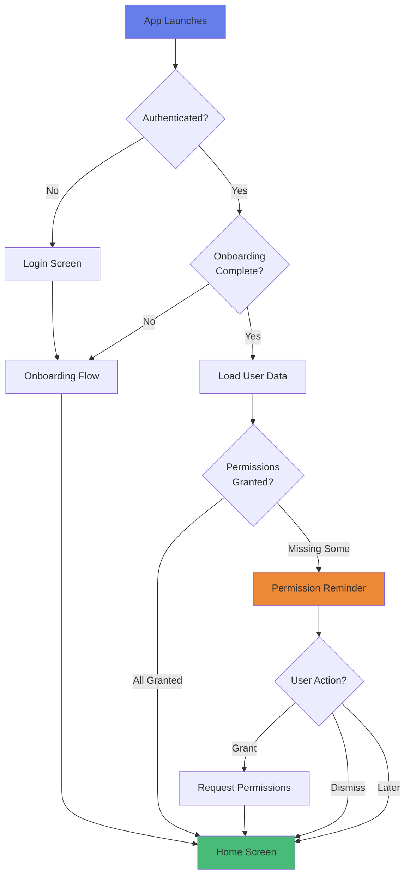
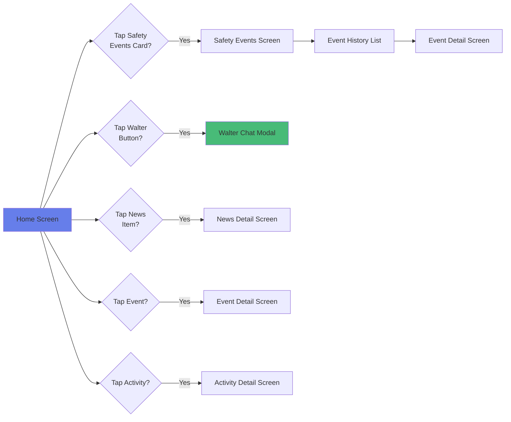
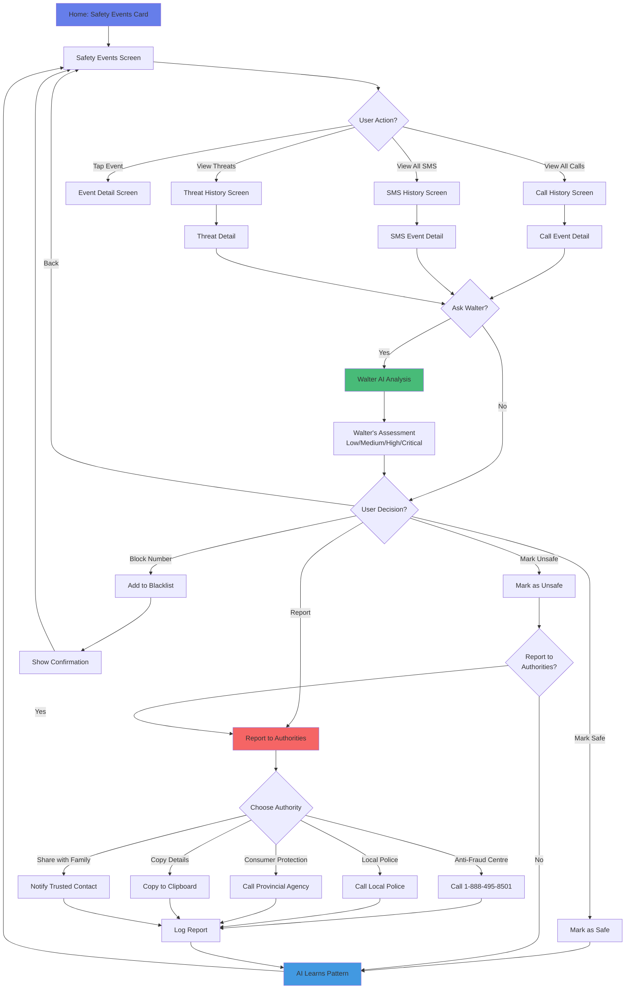
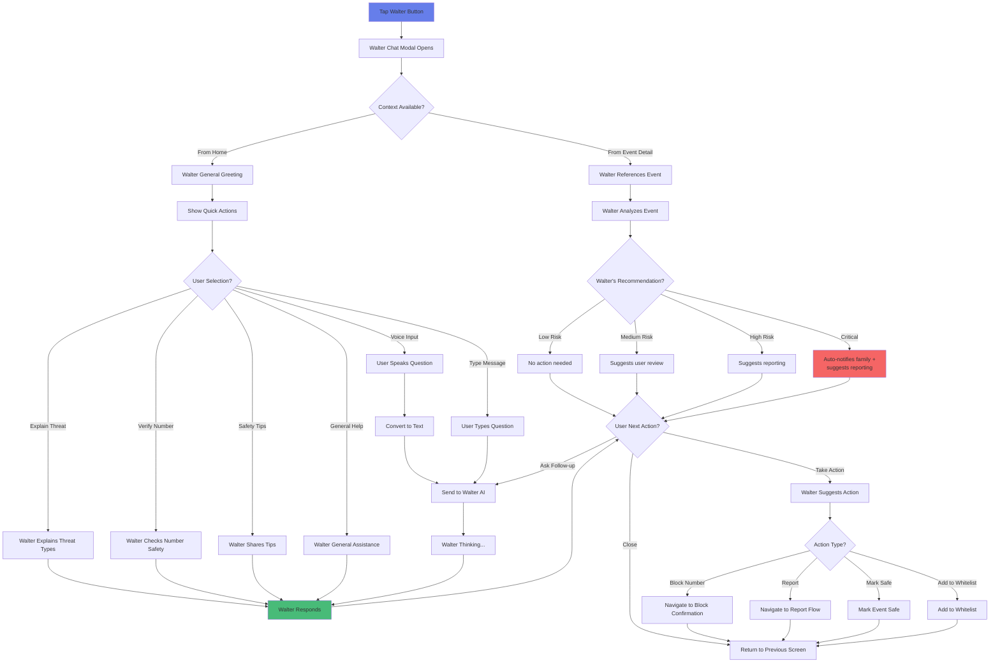
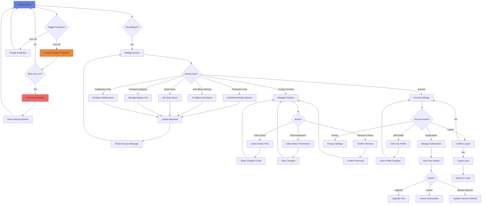
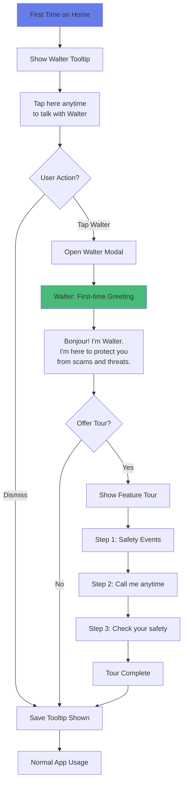
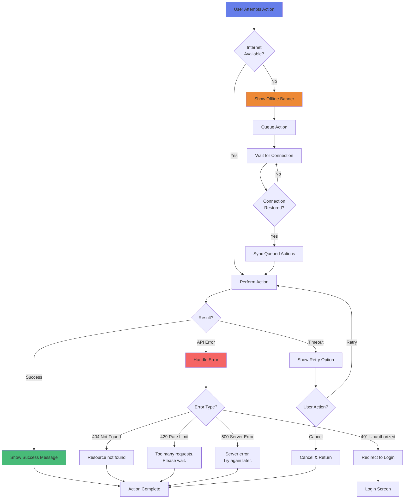
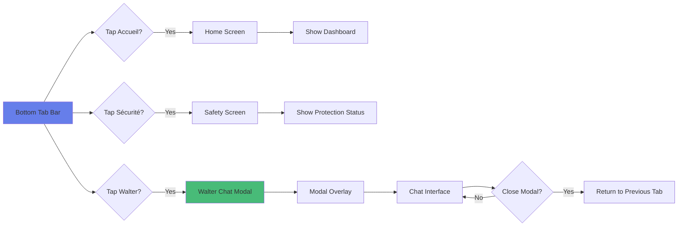
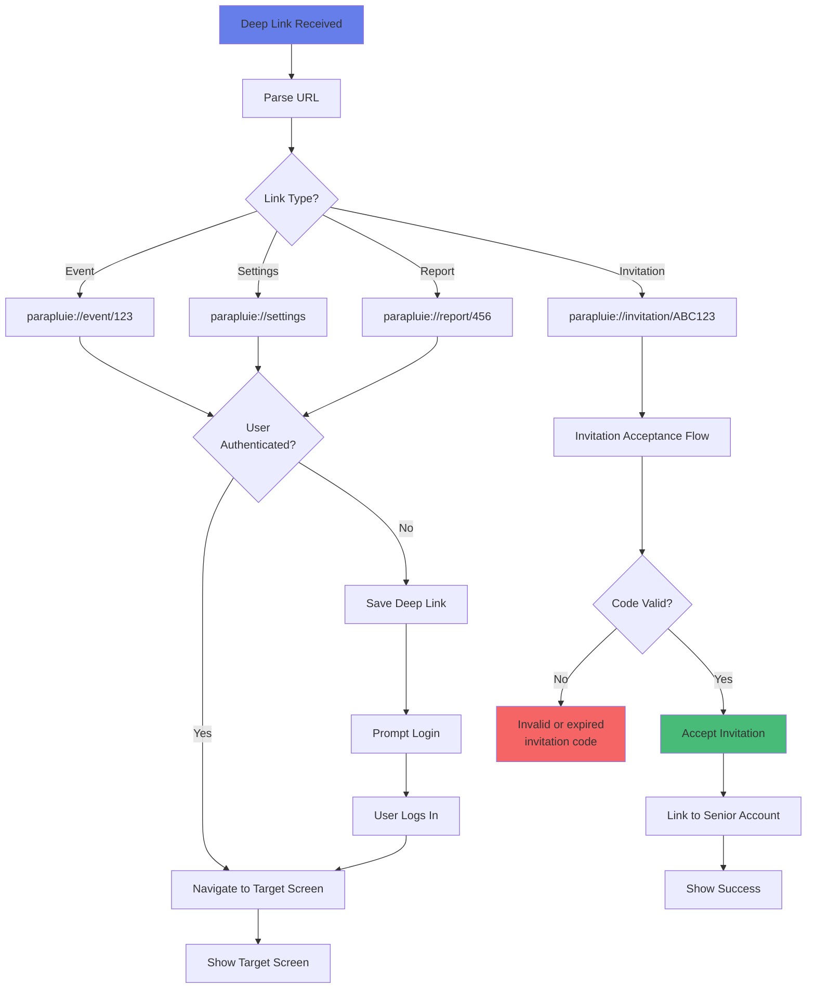

# Main App Navigation Flows

## Overview
This document specifies all user navigation flows within the main Parapluie app (post-onboarding), including primary user journeys, decision trees, and interaction patterns.

---

## 1. App Launch Flow



---

## 2. Home Screen Navigation



---

## 3. Safety Events Complete Flow



---

## 4. Walter Chat Interaction Flow



---

## 5. Settings & Profile Flow



---

## 6. Notification Handling Flow

```mermaid
flowchart TD
    NotificationReceived[Push Notification Received] --> NotifType{Notification Type?}

    NotifType -->|Threat Detected| ThreatNotif[Threat Alert]
    NotifType -->|Call Blocked| CallBlockedNotif[Call Blocked Alert]
    NotifType -->|SMS Flagged| SMSFlaggedNotif[SMS Flagged Alert]
    NotifType -->|Event Reminder| ReminderNotif[Event Reminder]
    NotifType -->|Family Alert| FamilyNotif[Family Alert]

    ThreatNotif --> NotifAction{User Taps Notification?}
    CallBlockedNotif --> NotifAction
    SMSFlaggedNotif --> NotifAction

    NotifAction -->|Tap Notification| OpenApp[Open App]
    NotifAction -->|Tap "Mark Safe"| QuickMarkSafe[Quick Action: Mark Safe]
    NotifAction -->|Tap "Block"| QuickBlock[Quick Action: Block Number]
    NotifAction -->|Dismiss| Dismissed[Notification Dismissed]

    OpenApp --> NavigateToEvent[Navigate to Event Detail]

    QuickMarkSafe --> UpdateEvent[Update Event Status]
    QuickBlock --> UpdateEvent

    UpdateEvent --> ShowToast[Show Confirmation Toast]
    ShowToast --> Done[Complete]

    ReminderNotif --> ReminderAction{User Action?}
    ReminderAction -->|Tap| OpenCalendar[Open Calendar Event]
    ReminderAction -->|Snooze| SnoozeReminder[Snooze for 10 min]
    ReminderAction -->|Dismiss| Dismissed

    FamilyNotif --> FamilyAction{User Action?}
    FamilyAction -->|Tap| OpenFamilyDashboard[Open Family Dashboard]
    FamilyAction -->|Call Contact| InitiateCall[Call Trusted Contact]
    FamilyAction -->|Dismiss| Dismissed

    NavigateToEvent --> EventDetailScreen[Event Detail Screen]
    OpenCalendar --> EventDetailScreen
    OpenFamilyDashboard --> FamilyScreen[Family Dashboard]

    style NotificationReceived fill:#667eea
    style ThreatNotif fill:#f56565
    style QuickMarkSafe fill:#48bb78
```

---

## 7. First-Time Feature Discovery Flow



---

## 8. Error & Offline Handling Flow



---

## 9. Tab Navigation Flow



---

## 10. Deep Link Handling Flow



---

## Navigation State Management

### Route Tracking
```typescript
interface NavigationState {
  currentRoute: string;
  previousRoute: string;
  history: string[];
  params: Record<string, any>;
}

// Example state:
{
  currentRoute: '/safety/events/evt_123',
  previousRoute: '/safety',
  history: ['/home', '/safety', '/safety/events', '/safety/events/evt_123'],
  params: { eventId: 'evt_123' }
}
```

### Deep Link Routes
```typescript
const deepLinkRoutes = {
  'parapluie://home': HomeScreen,
  'parapluie://event/:id': EventDetailScreen,
  'parapluie://invitation/:code': InvitationScreen,
  'parapluie://safety': SafetyScreen,
  'parapluie://settings': SettingsScreen,
  'parapluie://walter': WalterChatModal,
};
```

---

## Version History

- v1.0.0 (2025-01-15): Initial main app navigation flows
